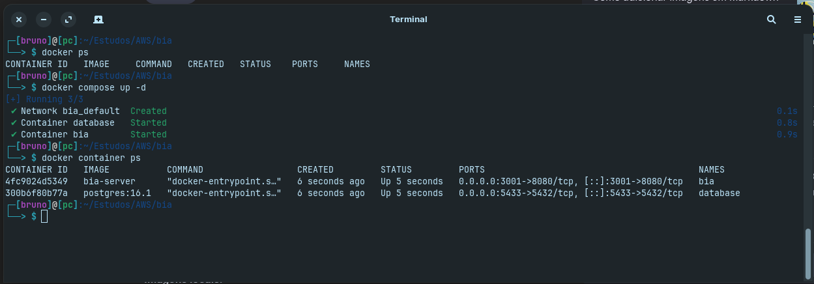
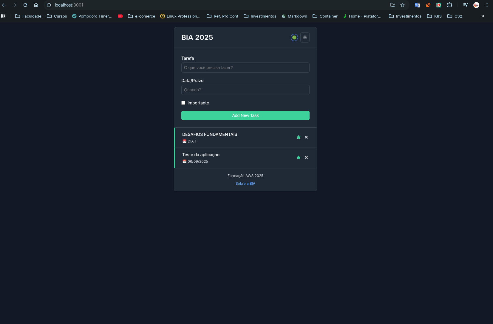
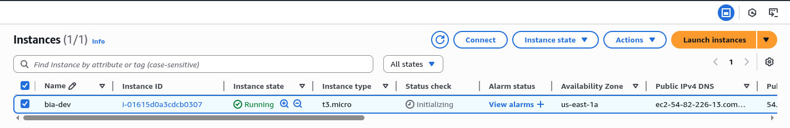
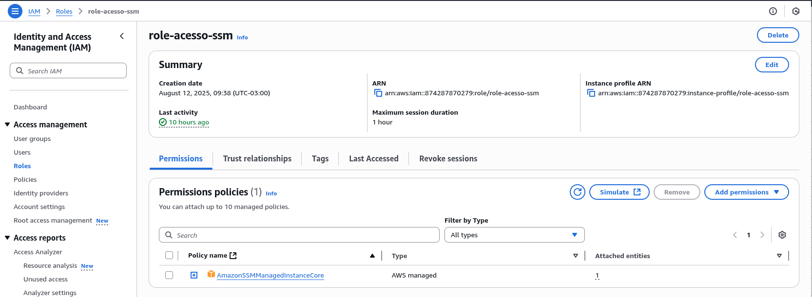
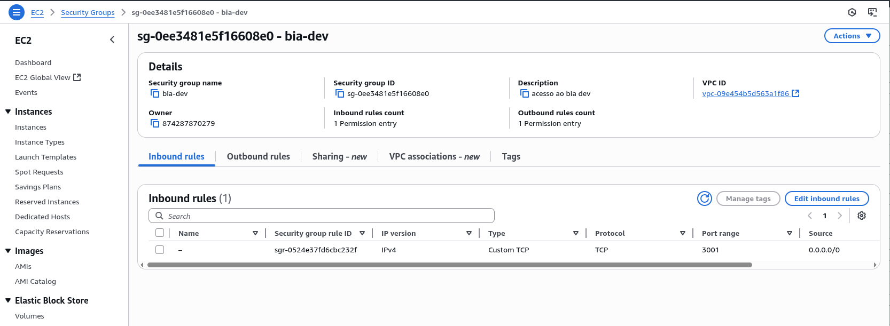
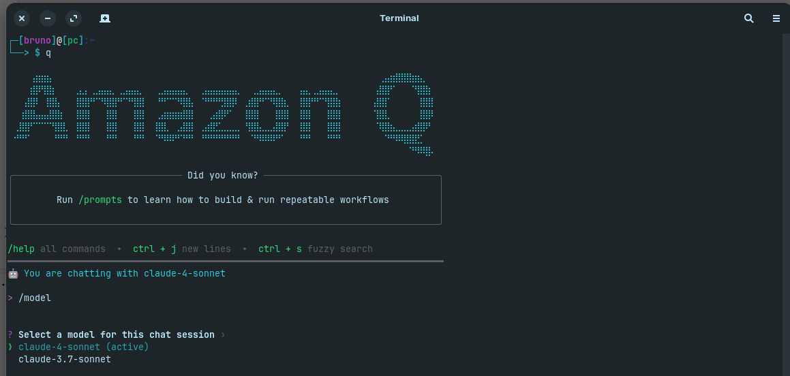

# Desafio 01 - Preparação do Ambiente e Implantação Inicial na AWS

## 🎯 Objetivo
O objetivo deste desafio foi configurar o ambiente local de desenvolvimento, preparar e testar uma aplicação web, e realizar o provisionamento inicial de recursos na AWS para rodar essa aplicação.

---

## 🛠️ Passos Executados

### 1️⃣ Preparação do Ambiente Local
Instalei as seguintes ferramentas essenciais:

- [**Docker**](#docker)  
- [**Git**](#git)  
- [**Amazon Q**](#amazon-q)  
- [**VSCode**](#vscode)  
- [**DBeaver**](#dbeaver)  

**Conceito:**  
- *Docker* permite empacotar aplicações e suas dependências em containers, garantindo que rodem de forma idêntica em qualquer ambiente.  
- *Git* é fundamental para versionamento e colaboração no desenvolvimento de software.  
- *Amazon Q* agiliza tarefas no ecossistema AWS com auxílio inteligente.  
- *VSCode* e *DBeaver* são ferramentas de produtividade para código e bancos de dados, respectivamente.

---

### 2️⃣ Clone da Aplicação
Foi feito o clone do repositório da aplicação React chamada **Bia**, que será usada durante o curso:

```bash
git clone https://github.com/henrylle/bia ./app
cd app
```

### 3️⃣ Build e Teste Local com Docker Compose

Utilizei o docker-compose para criar e subir a aplicação localmente:

```bash
docker compose up -d

```


Após o build, validei o acesso à aplicação via navegador na URL:

http://localhost:3001




Conceito:

- Docker Compose é uma ferramenta para definir e gerenciar aplicações multi-container usando um arquivo docker-compose.yml ou compose.yml.
- A porta 3001 foi exposta para permitir o acesso à aplicação no ambiente local.

### 4️⃣ Provisionamento de Instância EC2 na AWS

Na AWS, criei uma instância EC2 com as seguintes especificações:

- AMI: Amazon Linux
- Tipo: t3.micro (elegível no Free Tier)
- Região: São Paulo sa-east-1
- Hostname: bia-dev



Conceito:

- EC2 (Elastic Compute Cloud) é um serviço que fornece servidores virtuais escaláveis sob demanda.
- A AMI (Amazon Machine Image) é a imagem de sistema operacional pré-configurada.
- O tipo t3.micro é econômico e ideal para testes e estudos.

### 5️⃣ Criação de Role IAM para Acesso SSM

Criei uma role no IAM chamada role-acesso-ssm, com a policy:

```bash
AmazonSSMManagedInstanceCore
```




Essa role foi anexada à instância EC2 para permitir acesso via SSM (AWS Systems Manager).

Conceito:

- IAM Role define permissões para que serviços ou recursos da AWS executem ações.
- SSM (AWS Systems Manager) possibilita gerenciar instâncias sem precisar abrir portas como SSH.

### 6️⃣ Configuração do Security Group

Foi criado um Security Group para permitir o tráfego de entrada na porta 3001 de qualquer origem (0.0.0.0/0).

Conceito:

- Security Groups funcionam como firewalls virtuais para controlar o tráfego de entrada e saída das instâncias.
- Neste caso, liberar a porta 3001 é necessário para que a aplicação seja acessível externamente.




✅ Resultado Final

Ao final do desafio:

- Ambiente local configurado e aplicação rodando com Docker.
- Instância EC2 criada e configurada com acesso via SSM.
- Security Group liberando acesso à aplicação na porta 3001.

📚 Conceitos Abordados

- Docker e Docker Compose
- Git
- Amazon Q
- VSCode
- DBeaver
- Amazon EC2
- IAM Roles e Policies
- AWS Systems Manager (SSM)
- Security Groups

<hr>

🖥️ Instalação das Ferramentas

<a id="docker"></a>Docker

Documentação Oficial: [Clique aqui](https://docs.docker.com/get-docker/)
Repositório local: [Clique aqui](https://github.com/bruno-salmito/Docker/)

Instalação no Linux (Ubuntu/Debian):

```bash
curl -fsSl https://get.docker.com | bash
dockker --version
```

Por padrão, após a instalação, é necessário usar sudo sempre que for executar um comando Docker. Por exemplo
```bash
sudo docker run hello-world
```
Isso acontece por questões de segurança, já que o Docker precisa de permissões elevadas para funcionar, para evitar ter que digitar sudo toda vez, vamos adicionar o nosso usuário ao grupo docker.
```bash
sudo usermod -aG docker $USER
```
Obs: É necessário reiniciar a sessão.


<a id="git"></a>Git

Documentação Oficial: https://git-scm.com/downloads

Instalação no Linux:
```bash
sudo apt update
sudo apt install -y git
```

Configuração inicial:
```bash
git config --global user.name "Seu Nome"
git config --global user.email "seuemail@exemplo.com"
```

<a id="amazon-q"></a>Amazon Q

Documentação Oficial: [Clique aqui](https://docs.aws.amazon.com/amazonq/)
Instalação no ubuntu: [Clique aqui](https://docs.aws.amazon.com/amazonq/latest/qdeveloper-ug/command-line-installing.html#command-line-installing-ubuntu)
Instalação no AmazonLinux: [Clique aqui](https://docs.aws.amazon.com/amazonq/latest/qdeveloper-ug/command-line-installing-ssh-setup-autocomplete.html)
Fazer o download do Amazon Q command line
```bash
wget https://desktop-release.q.us-east-1.amazonaws.com/latest/amazon-q.deb
```

Executar a instalação
```bash
sudo apt-get install -f
sudo dpkg -i amazon-q.deb
```
Para abrir e começar a utilizar o Amazon Q dite a letra q no console.



<a id="vscode"></a>VSCode

Site Oficial: https://code.visualstudio.com/


<a id="dbeaver"></a>DBeaver

Site Oficial: https://dbeaver.io/download/

