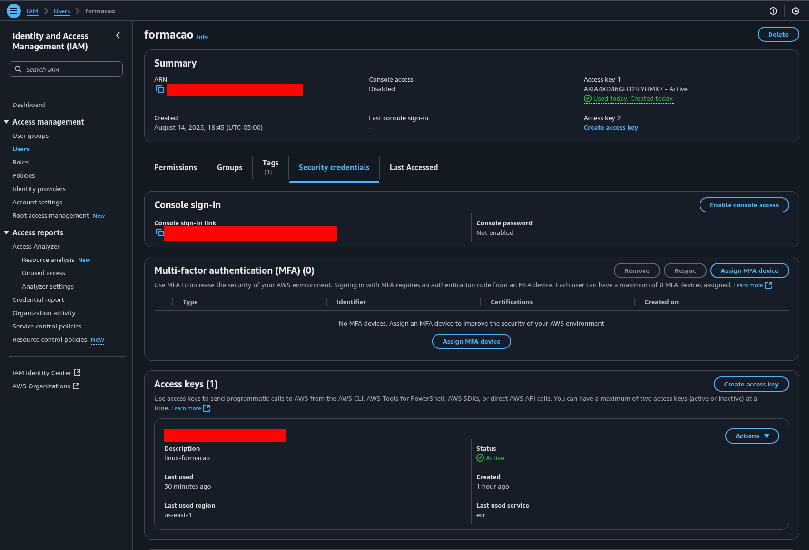
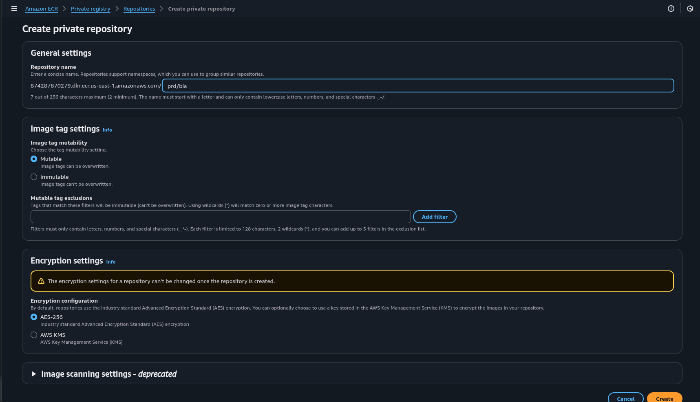
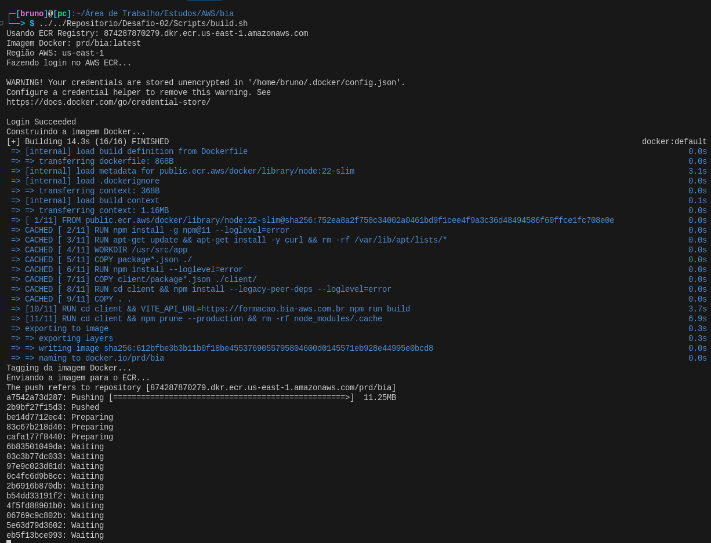
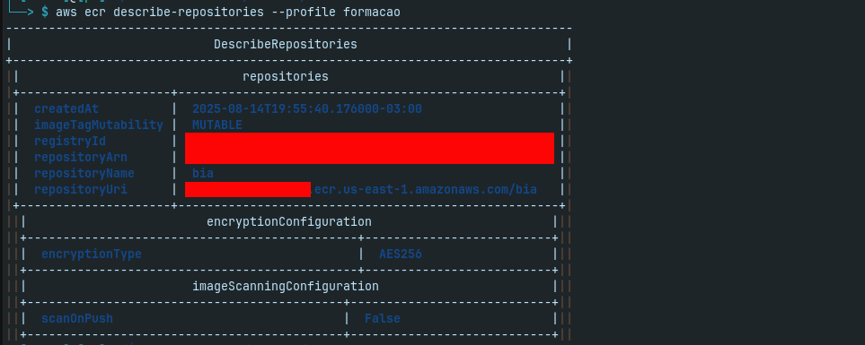
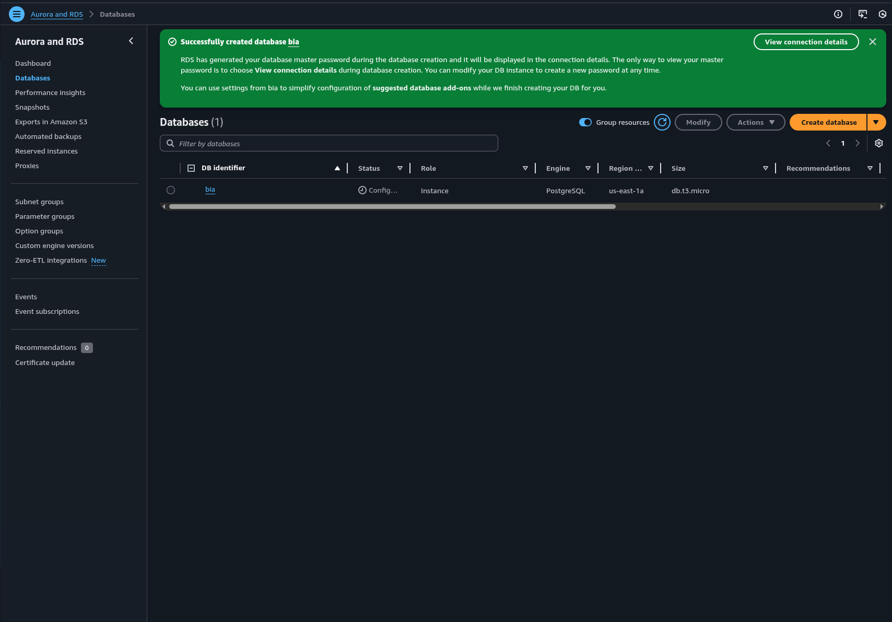
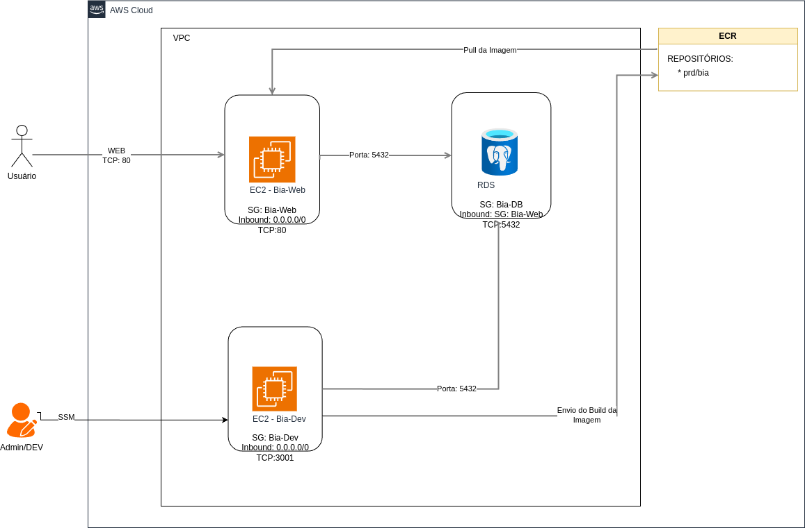
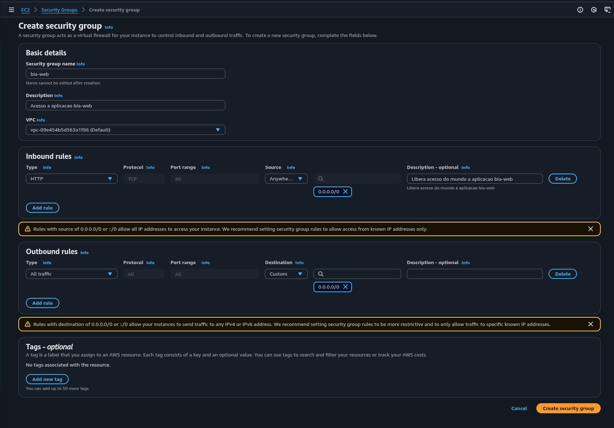
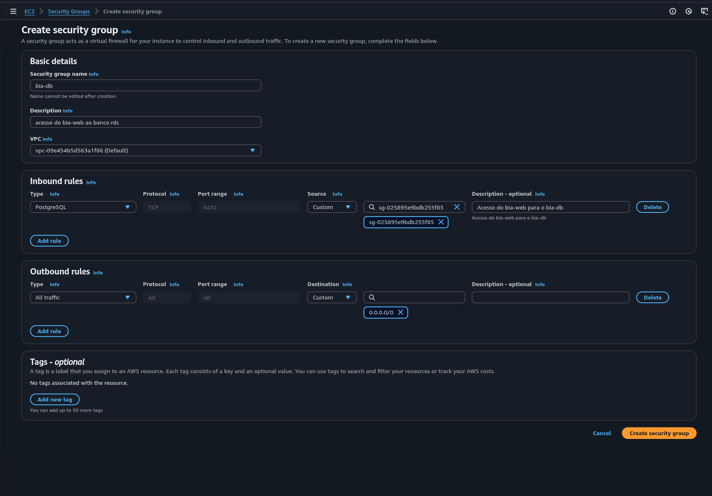
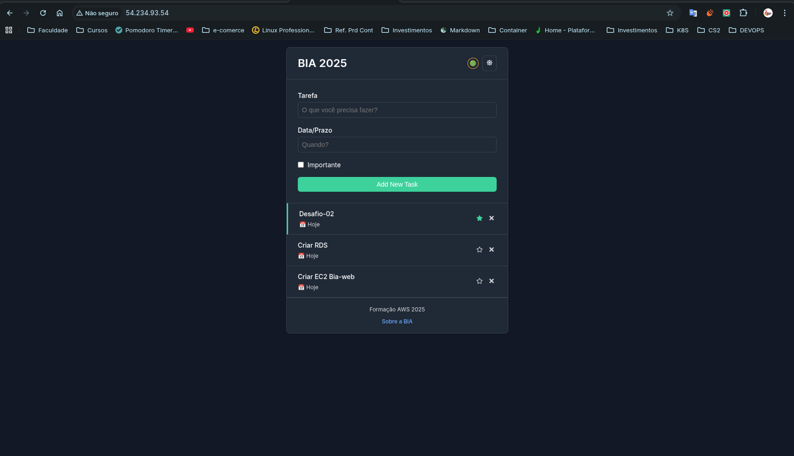
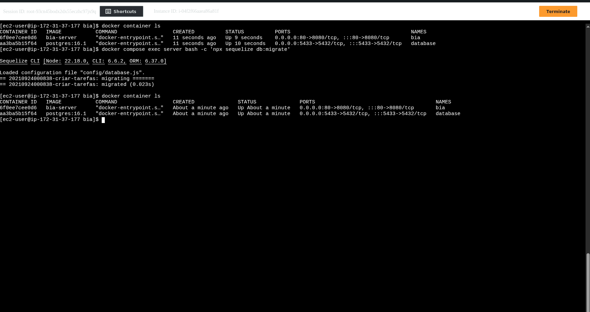

# Desafio 02 - Conexão com a AWS via CLI, SSH e SSM + Publicação no ECR

## 🎯 Objetivo
O objetivo deste desafio foi configurar o acesso à AWS a partir do meu computador rodando Linux, testar diferentes formas de conexão com instâncias EC2 (SSH e SSM), trabalhar com imagens Docker e publicá-las no Amazon ECR.  
Além disso, foram revisados conceitos importantes como **VPC, Security Group, IAM Roles e Policies** e estudadas diferenças entre arquiteturas **x86** e **ARM**.

---

## 🛠️ Passos Executados

### 1️⃣ Preparação da VM e Instalação de Dependências
Após finalizar a configuração da minha máquina virtual, instalei as ferramentas necessárias para interagir com a AWS:

- [**AWS CLI**](#aws-cli)  
- [**Session Manager Plugin**](#session-manager-plugin)  

**Conceito:**  
- *AWS CLI* (Command Line Interface) permite gerenciar serviços AWS diretamente pelo terminal.  
- *Session Manager Plugin* é usado para permitir conexões com instâncias via AWS Systems Manager (SSM), sem necessidade de abrir portas de rede.
- *MCP* (Model Context Protocol) é um protocolo aberto padronizado que permite que aplicações forneçam contexto para LLMs (Larg Language Models).
- *ECR* (Elastic Container Registry) é o serviço de registro de containers Docker totalmente gerenciado pela AWS.
    * Função Principal
        * Armazena, gerencia e implanta imagens Docker
        * Registry privado e seguro para nossas aplicações
    * Características
        * **Integração nativa** com ECS, EKS e outros serviços AWS.
        * **Segurança:** Criptografia em reposuo e em trânsito.
        * **Controle de acesso:** Ingrado com IAM
        * **Versionamento:** Suporte a tags de imagens
- *ECS* (Elastic Container Service) é o serviço de orquestração de containers totalmente gerenciado.
    * Função Principal
        * Executa e gerencia containers Docker em escala
        * Orquestra aplicações containerizadas
    * Componentes Principais
        * **Cluster:** Grupo de recursos computacionais (EC2 ou Fargate).
        * **Task Definition:** "Receita" que define como o container deve rodar.
        * **Task:** Instância em execução de uma task definition.
        * **Service:** Garante que um número específico de task esteja rodando, podemos comparar um service com um container. 
    * Tipos de launch
        * **EC2:** Você gerencia as instâncias.
        * **Fargate** Serverless, AWS gerencia a infraestrutura.
- *VPC* (Virtual Private Cloud) é um ambiente de rede virtual isolado dentro de uma nuvem pública, ela é uma rede virtual muito semelhante a uma rede tradicional, nela podemos definir
    * Intervalo de endereços IP (CIDR ex: 10.0.0.0/16).
    * Sub-redes (subnets).
    * Regras de firewall (security groups, NACLs).
    * Gateways de saída para a internet ou para outras redes (Internet Gateway, NAT Gateway, VPN, Direct Connect).
- *Subnet* é a divisão lógica de uma VPC, consiste em um intervalo de endereços IP. Cada Sub-rede fica alocada em uma única zona de disponibilidade.

<p align="center">
    
</p>

- *Security Group* é um firewall virtual que controla o tráfego de entrada (*inbound*) e saída (*outbound*) de instâncias EC2, permitindo definir regras de segurança baseadas em IP, protocolo e porta.

- *RDS* (Relational Database Service) é um serviço gerenciado de banco de dados relacional da AWS.
    * Função Principal
        * Facilita a configuração, operação e escalonamento de bancos de dados relacionais na nuvem
        * Automatiza tarefas administrativas como backup, patches e atualizações
    * Características
        * **Engines suportadas:** MySQL, PostgreSQL, MariaDB, Oracle, SQL Server
        * **Alta disponibilidade:** Suporte a Multi-AZ para redundância
        * **Backup automático:** Snapshots diários e retenção configurável
        * **Monitoramento:** Métricas integradas com CloudWatch
        * **Segurança:** Criptografia em repouso e em trânsito

---

### 2️⃣ Conexão com a AWS via AWS CLI
Configurei minha conta AWS na VM para autenticação com a CLI:

```bash
aws configure --profile formacao
    AWS Access Key ID [None]: AKIA4XD46**********
    AWS Secret Access Key [None]: 2xue****************
    Default region name [None]: us-east-1
    Default output format [None]: table
```
Parâmetros configurados:

- AWS Access Key ID
- AWS Secret Access Key
- Default region name
- Default output format

Conceito:
Essa configuração cria o arquivo ~/.aws/credentials, permitindo que a CLI se autentique em qualquer comando executado.

Para gerar o Access Key navegue até a console da [AWS](https://console.aws.amazon.com/).
- Navegue para o painel do IAM
- Clique no usuário que foi criado
- Clique na aba **Security credentials**
- Em Access Keys clique em **create access key**, selecione other, next e create access key



### 3️⃣ Conexões por SSH e SSM

Pratiquei o acesso à instância EC2 utilizando:

- SSH: conexão tradicional via chave privada (.pem). Se não existir um key par é necessário criar. (Esse método de acesso embora não é recomendado se comparado ao SSM). 
- SSM: acesso via Systems Manager, sem necessidade de abrir portas como 22 (SSH).

Comandos usados:

**Acesso por SSH**
```bash
chmod 400 minha-chave.pem
ssh -i minha-chave.pem ec2-user@IP_PUBLICO
```

**Acesso via SSM**
```bash
aws ssm start-session --target i-********* --profile formacao
```

Conceito:

- SSH exige abertura de porta e uso de chave privada.
- SSM é mais seguro, pois utiliza o agente do Systems Manager e uma role IAM para autenticação, sem expor portas à internet.

Prós e contras de cada um.

**SSH (Secure Shell)**

Prós:

* *Ampla compatibilidade:* Funciona em praticamente qualquer sistema Linux ou Unix-like.
* *Controle total:* Permite executar qualquer comando no servidor, copiar arquivos com scp ou rsync e até encaminhar portas.
* *Desempenho:* Geralmente mais rápido que SSM para sessões interativas diretas.
* *Independência de serviços adicionais:* Não depende de configuração de agente extra (além do daemon SSH) ou permissões IAM da AWS.

Contras:

* *Gerenciamento de chaves:* Precisa gerenciar manualmente pares de chaves ou senhas, o que pode ser trabalhoso e arriscado em ambientes grandes.
* *Exposição à rede:* Normalmente requer abertura de portas (22) na VPC ou na Internet, aumentando superfície de ataque.
* *Auditoria limitada:* Difícil rastrear quem executou o quê sem ferramentas extras (como auditd ou soluções de logging).
* *Escalabilidade:* Em ambientes grandes, manter acessos SSH para centenas de instâncias pode ser complexo e propenso a erros.

**SSM (AWS Systems Manager)**

Prós:

* *Sem necessidade de abrir portas:* Funciona via agente SSM sem expor a porta 22 à Internet.
* *Controle centralizado:* Permite gerenciar acessos via IAM, sem compartilhar chaves SSH.
* *Auditoria integrada:* Todas as sessões podem ser registradas no CloudTrail ou em logs do SSM, facilitando compliance.
* *Automação:* Facilita execução de comandos remotos, scripts ou patches em múltiplas instâncias de forma centralizada.
* *Conectividade híbrida:* Funciona também em instâncias on-premises conectadas ao SSM Agent, sem VPN.

Contras:

* *Dependência de agente:* Requer que o SSM Agent esteja instalado e atualizado nas instâncias.
* *Limitações de interface:* Nem todos os comandos interativos funcionam tão bem quanto no SSH tradicional; algumas operações podem ser menos intuitivas.
* *Performance:* Pode ser mais lento para sessões interativas complexas devido ao canal intermediário gerenciado pela AWS.
* *Curva de aprendizado:* Administradores acostumados com SSH podem precisar de tempo para se familiarizar com o SSM e suas políticas IAM.

Resumo prático:

**SSH:** melhor para acesso direto e operações manuais, especialmente em poucas máquinas ou em testes.
**SSM:** melhor para ambientes corporativos, seguros, auditáveis e automatizados, sem necessidade de expor portas e com gestão centralizada.

### 4️⃣ Trabalho com Imagens Docker e Publicação no ECR

##### Criando Repositório ECR

###### Via Console Web AWS:
1. Acesse o Console AWS e navegue até o serviço ECR
2. Clique em "Create repository" 
3. Selecione "Private" como visibilidade
4. Digite "prd/bia" como nome do repositório
5. (Opcional) Adicione tags se desejar
6. Clique em "Create repository"



#### Via AWS CLI:
```bash
# Criar repositório
aws ecr create-repository \
    --repository-name prd/bia \
    --image-scanning-configuration scanOnPush=true \
    --region us-east-1

# Verificar se foi criado
aws ecr describe-repositories --repository-names prd/bia
``` 
Você também pode utilizar os em [Scripts](./Scripts/).

Criei e testei imagens Docker localmente, depois publiquei no Amazon Elastic Container Registry (ECR):

```bash
#Login no ECR
aws ecr get-login-password --region us-east-1 | docker login --username AWS --password-stdin <ID_AWS>.dkr.ecr.us-east-1.amazonaws.com

# Build da imagem
docker build -t bia .
# Tag da imagem
docker tag bia:latest <ID_AWS>.dkr.ecr.us-east-1.amazonaws.com/bia:latest
# Push para o ECR
docker push <ID_AWS>.dkr.ecr.us-east-1.amazonaws.com/bia:latest
```
Deixo um [Script](./Scripts/build.sh) que automatiza esse processo.



Conceito:

- ECR é um repositório gerenciado de imagens Docker na AWS.
- O push para o ECR permite que a imagem seja utilizada em serviços como ECS, EKS ou diretamente em EC2.

```bash
#Mostra os repositórios
aws ecr describe-repositories --profie formacao
```


##### Criando RDS

###### Via Console Web AWS:
1. Acesse o Console AWS e navegue até o serviço RDS
2. Clique em "Create database"
3. Selecione o método "Standard create"
4. Escolha o engine (MySQL, PostgreSQL etc)
5. Selecione a versão do engine
6. Escolha o template (Production, Dev/Test, Free tier)
7. Configure:
   - DB instance identifier
   - Master username e password
   - Instance size
   - Storage type e size
   - Multi-AZ deployment
   - VPC e Security Group
   - Public access
   - Database authentication
8. Clique em "Create database"



###### Via AWS CLI:
```bash
# Criar RDS
aws rds create-db-instance \
    --db-instance-identifier bia \
    --db-instance-class db.t3.micro \
    --engine mysql \
    --master-username postgress \
    --master-user-password postgress \
    --allocated-storage 20 \
    --vpc-security-group-ids sg-bia-db \
    --availability-zone us-east-1a \
    --port 5432

# Verificar status da criação
aws rds describe-db-instances \
    --db-instance-identifier bia

# Obter endpoint de conexão
aws rds describe-db-instances \
    --db-instance-identifier bia \
    --query 'DBInstances[0].Endpoint.Address' \
    --output text
```

### 5️⃣ Revisão de Conceitos Importantes

Durante o desafio, revisamos:

- VPC: rede virtual privada onde ficam os recursos da AWS.
- Security Group: firewall que controla o tráfego de entrada e saída.
- Role: conjunto de permissões atribuídas a um recurso ou serviço.
- Policy: documento JSON que define permissões específicas.
- IAM: serviço para gerenciar usuários, grupos, roles e policies.

### 6️⃣ Diferença entre Arquiteturas x86 e ARM

- x86: mais comum em desktops e servidores, maior compatibilidade de software.
- ARM: mais eficiente em consumo de energia, usado em dispositivos móveis e, cada vez mais, em servidores cloud (como instâncias Graviton na AWS).

Importante entender essa diferença, pois imagens Docker precisam ser compatíveis com a arquitetura da instância onde serão executadas.

<hr>

### 📚 Conceitos Abordados

- AWS CLI
- Session Manager Plugin
- SSH
- SSM
- Docker
- ECR
- VPC
- Security Group
- IAM Role e Policy
- Arquiteturas x86 e ARM
<hr>

### 🖥️ Instalação das Ferramentas

<a id="aws-cli"></a>AWS CLI

Documentação Oficial: [Clique aqui](https://docs.aws.amazon.com/cli/)
Documentação Utilizada: [Clique aqui](https://docs.aws.amazon.com/cli/latest/userguide/getting-started-install.html)

**Instalação no Linux:**
```bash
#Baixa o pacote de instalação do aws-cli
curl "https://awscli.amazonaws.com/awscli-exe-linux-x86_64.zip" -o "awscliv2.zip"
#Descompacta o pacote de instalação
unzip awscliv2.zip
#Instala o aws-cli
sudo ./aws/install
#Verifica a versão instalada
aws --version
```

<a id="aws-sam-cli"></a>AWS SAM Cli
Documentação Utilizada: [Clique aqui](https://docs.aws.amazon.com/serverless-application-model/latest/developerguide/install-sam-cli.html)


<a id="session-manager-plugin"></a>Session Manager Plugin

Documentação Oficial: [Clique aqui](https://docs.aws.amazon.com/systems-manager/latest/userguide/session-manager-working-with-install-plugin.html)
Documentação Utilizada: [Clique aqui](https://docs.aws.amazon.com/systems-manager/latest/userguide/install-plugin-debian-and-ubuntu.html)

**Instalação no Linux:**
```bash
#Baixa o Pacote de instalação
curl "https://s3.amazonaws.com/session-manager-downloads/plugin/latest/ubuntu_64bit/session-manager-plugin.deb" -o "session-manager-plugin.deb"
#Instala o pacaote
sudo dpkg -i session-manager-plugin.deb
#Verifica a versão
session-manager-plugin --version
```
<hr>

### Resultado Final

Ao final do desafio:

- VM configurada com AWS CLI e Session Manager Plugin.
- Conexões realizadas via SSH e SSM.
- Imagem Docker criada localmente e publicada no ECR.
- Conceitos de rede, segurança e arquitetura revisados.

##### Arquitetura do Desafio-02




##### Security Groups e Aplicação Rodando.





##### Aplicação e SSM.






<hr>

### Sites para consulta
- [Documentação Oficial AWS](https://docs.aws.amazon.com/)
- [Documentação Oficial Docker](https://docs.docker.com/)
- [Documentação Oficial Linux](https://www.kernel.org/doc/html/latest/)
- [Documentação Oficial Git](https://git-scm.com/doc)
- [Instance Vantage](https://instances.vantage.sh/)