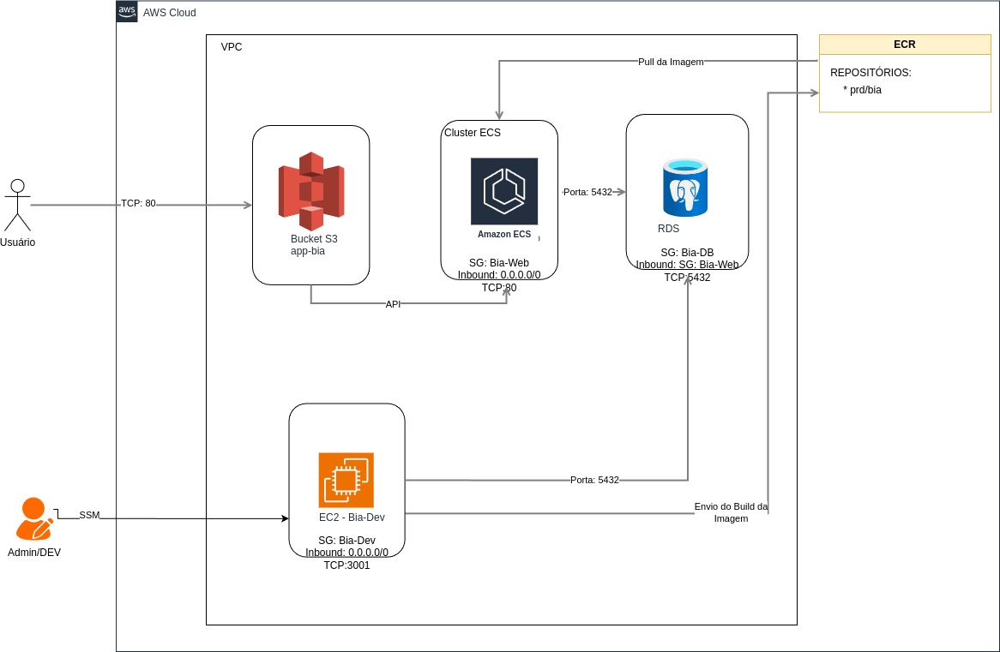
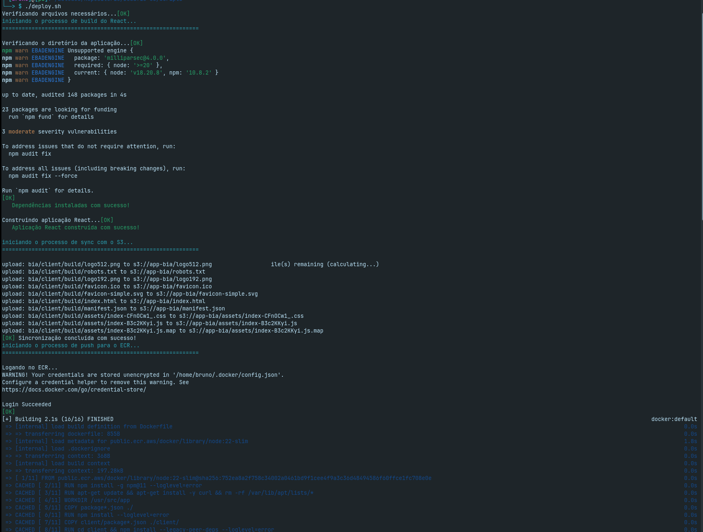
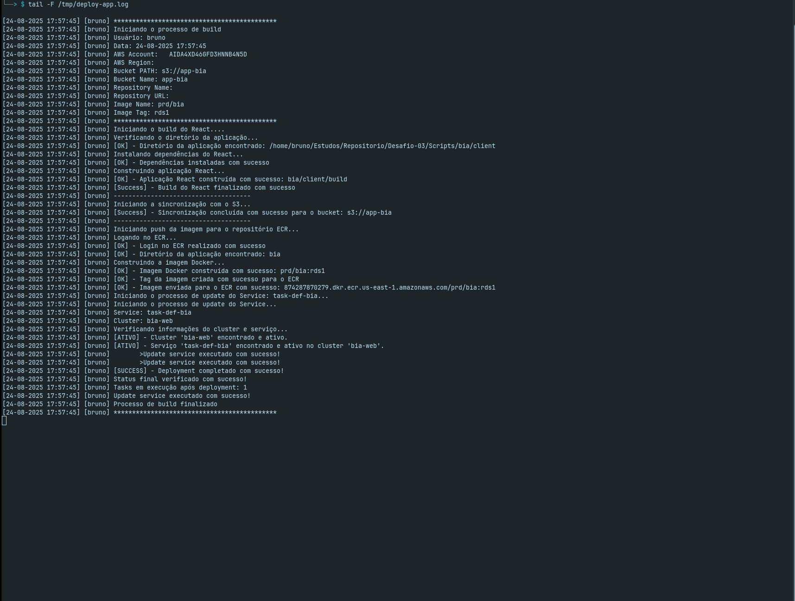
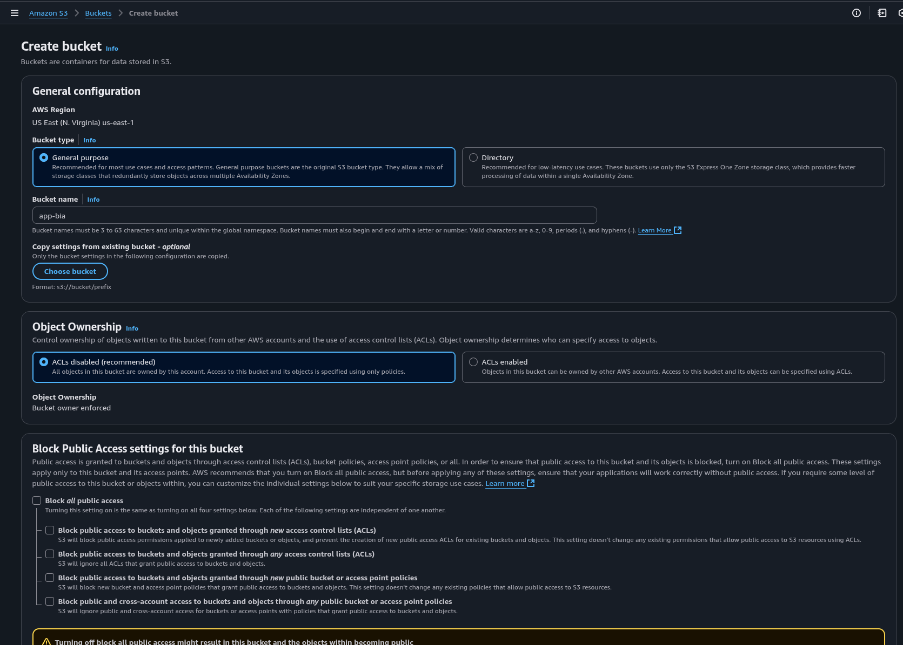
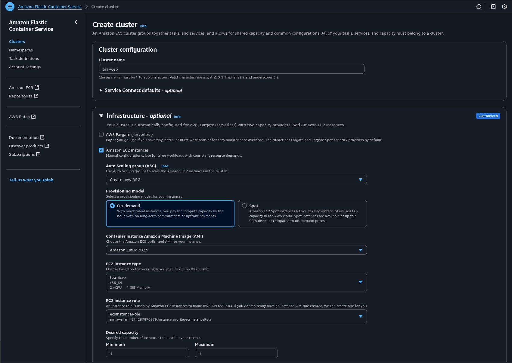
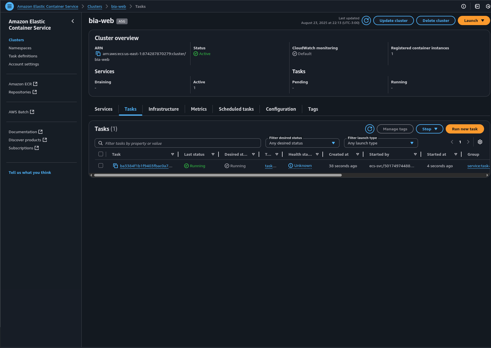
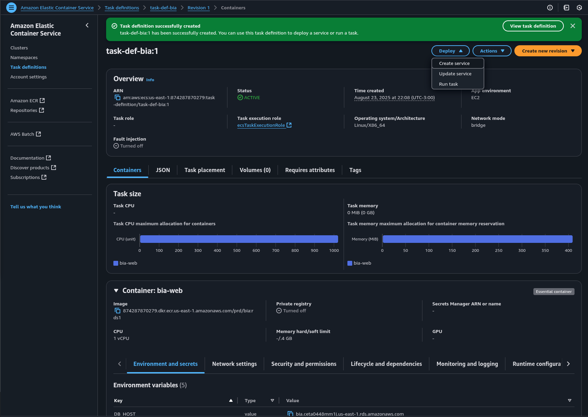
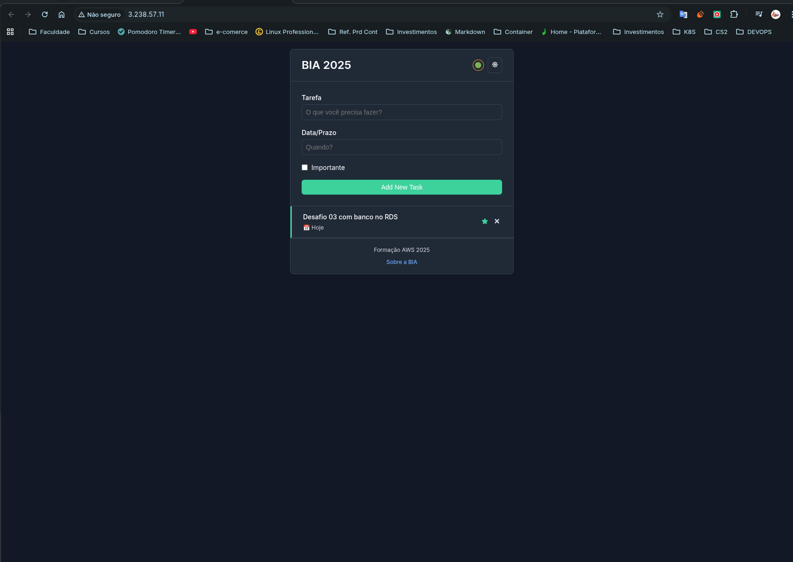
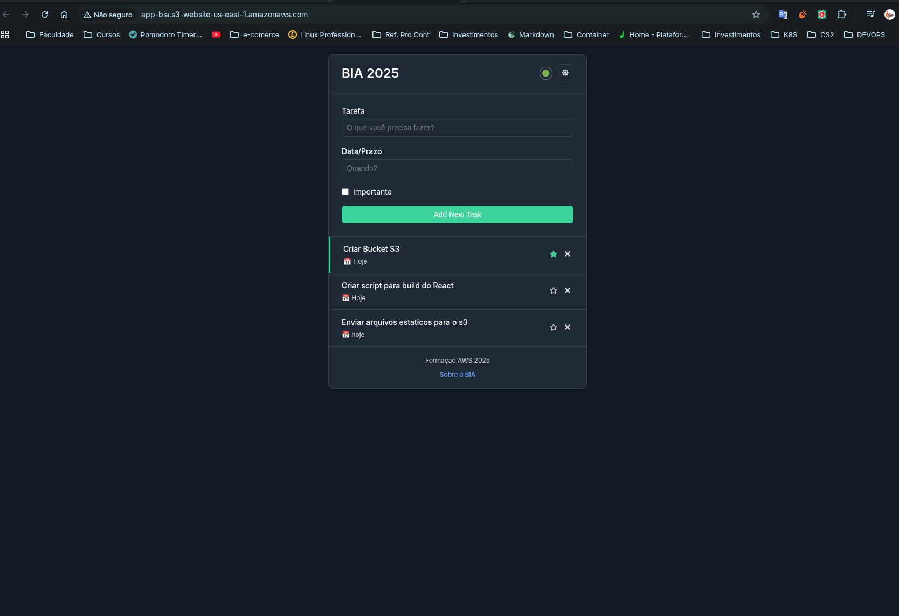

# Desafio 03 - Deploy da BIA no ECS + Assets no S3

## 🎯 Objetivo
O objetivo deste desafio foi colocar a aplicação **BIA** rodando em um **Cluster ECS (bia-web)**, com os **assets estáticos** sendo entregues a partir de um bucket S3 configurado como **site estático**.

Além disso, construímos nossa primeira rotina de deploy utilizando **Shell Script**, garantindo a separação entre a entrega do frontend e backend do projeto.

Para visualizar todos os scripts e enteder o como cada um trabalha [Clique aqui](./Scripts/README.md)

Essa vai ser nossa arquitura final do desafio-03

<p align="center">
    
</p>

---

## 🛠️ Passos Executados

### 1️⃣ Criação da Rotina de Deploy com Shell Script

- Desenvolvi um script [Deploy.sh](./Scripts/deploy.sh) em **shell script** responsável por automatizar o processo de build e deploy da aplicação.
- Esse script simplifica o envio da imagem do backend para o **ECR** e também a sincronização dos arquivos do frontend para o **S3**, além de salvar todo o processo em um arquivo de log.  

<p align="center">
  
</p>

<p align="center">
  
</p>

**Conceito:**  
- *Shell Script* permite automatizar tarefas repetitivas no Linux, criando rotinas reprodutíveis.  
- No contexto de DevOps, scripts de deploy são fundamentais para garantir consistência e reduzir erros manuais.


---

### 2️⃣ Criação do Site Estático no S3
Criei um bucket S3 configurado como **static website hosting**, em fiz upload dos assets do frontend da aplicação React (BIA).  
Configurei permissões para permitir acesso público de leitura aos arquivos.

```bash
{
  "Version": "2012-10-17",
  "Statement": [
    {
      "Sid": "PublicReadGetObject",
      "Effect": "Allow",
      "Principal": "*",
      "Action": "s3:GetObject",
      "Resource": "arn:aws:s3:::app-bia/*"
    }
  ]
}
```

Abaixo os procedimentos para criar um Bucket S3

##### Via Console Web AWS:
1. Acesse o Console AWS e navegue até o serviço S3
2. Clique em "Create bucket"
3. Configure o bucket:
   - Digite um nome único globalmente
   - Selecione a região
   - Desmarque "Block all public access"
4. Em "Properties", habilite "Static website hosting"
5. Em "Permissions":
   - Adicione uma Bucket Policy permitindo acesso público de leitura
   - Configure CORS se necessário
6. Faça upload dos arquivos do frontend
7. Configure o index.html como documento padrão



##### Via AWS CLI:
```bash
# Criar bucket
aws s3 mb s3://app-bia --region us-east-1

# Habilitar website hosting
aws s3 website s3://app-bia \
  --index-document index.html \
  --error-document error.html

# Configurar política de acesso público
aws s3api put-bucket-policy --bucket app-bia --policy '{
    "Version": "2012-10-17",
    "Statement": [
        {
            "Sid": "PublicReadGetObject",
            "Effect": "Allow",
            "Principal": "*",
            "Action": "s3:GetObject",
            "Resource": "arn:aws:s3:::app-bia/*"
        }
    ]
}'

# Sincronizar arquivos locais com o bucket
aws s3 sync ./build/ s3://app-bia

# Verificar configuração
aws s3api get-bucket-website --bucket nome-do-bucket
```

Conceito:
- *Amazon S3* é um serviço de armazenamento de objetos altamente escalável.  
- A funcionalidade de **Static Website Hosting** permite servir arquivos HTML, CSS, JS e assets diretamente da nuvem, sem necessidade de servidor web tradicional.


### 3️⃣ Deploy do Backend no ECS

Comecei criando um **Cluster ECS** chamado bia-web, depois uma **task definition** contendo todas as variáveis de ambiente para conexção com o nosso banco no RDS.

Garanti que o **Service** mantivesse a aplicação disponível e em execução.




Após criado o cluster foi necessário executar as migration no banco RDS.

```bash
# Cria o banco de dados BIA
docker compose exec server bash -c 'npx sequelize db:create'

# Cria as tabelas no banco bia
docker compose exec server bash -c 'npx sequelize db:migrate'
```

Conceito:

- *ECS (Elastic Container Service)* é um orquestrador de containers da AWS.  
- Os principais componentes são:
  - **Cluster**: agrupamento de recursos de computação (EC2 ou Fargate).  
  - **Task Definition**: define a “receita” de como o container deve ser executado.  
  - **Service**: garante que a quantidade desejada de tasks esteja sempre em execução.


### 4️⃣ Separação entre Frontend e Backend

- **Frontend**: hospedado no **S3** como site estático.  
- **Backend**: rodando em **ECS**, dentro do cluster **bia-web**.  

Essa separação traz benefícios como:
- Maior escalabilidade (backend e frontend podem crescer de forma independente).  
- Melhor segurança (frontend público no S3 e backend restrito em VPC com Security Groups).  
- Redução de custos (S3 é mais barato que manter um servidor rodando só para servir arquivos estáticos).  

<hr>

### 📚 Conceitos Abordados

- Shell Script
- Amazon S3 (Static Website Hosting)
- ECS (Elastic Container Service)
- Task Definition
- Service
- Cluster ECS
- ECR (Elastic Container Registry)
- Separação Frontend/Backend
<hr>

### Resultado Final

Ao final do desafio:

- Script de deploy criado e funcionando.  
- Frontend hospedado no S3 como site estático.  
- Backend rodando no ECS cluster bia-web.  
- Aplicação BIA separada em duas camadas (frontend e backend) de forma escalável e segura.  

##### Arquitetura do Desafio-03


##### Cluster ECS, Task Definition e Service.






##### Bucket S3.




<hr>

### Sites para consulta
- [O que é o Amazon S3](https://docs.aws.amazon.com/pt_br/AmazonS3/latest/userguide/Welcome.html)
- [Configurando Website Static](https://docs.aws.amazon.com/AmazonS3/latest/userguide/website-hosting-custom-domain-walkthrough.html)
